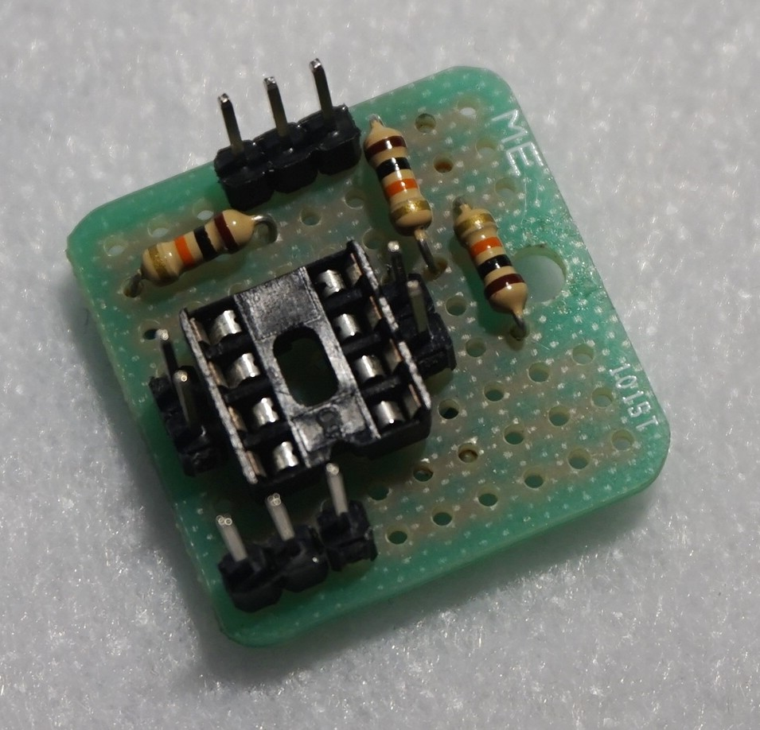
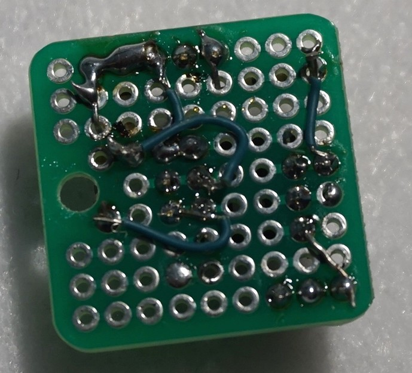
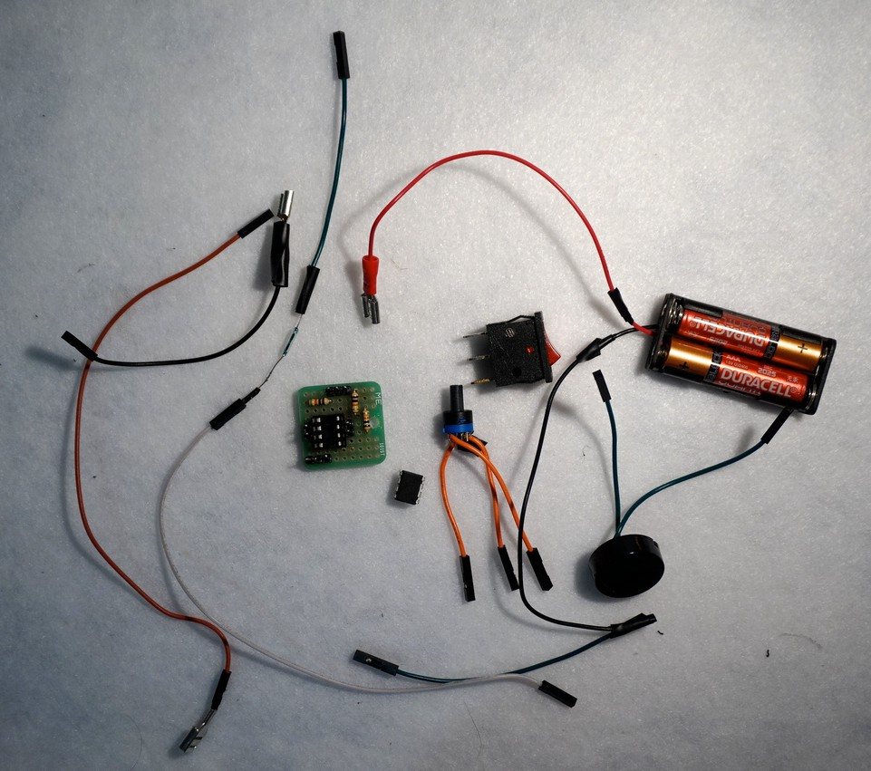
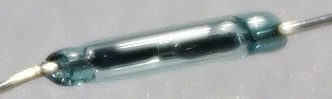

# Assembly

These instructions should normally be enough to go from raw parts listed below to a functional
music box. Part numbers referred here come from the schematic. Refer to it.

## Parts

* ATtiny45-10PU (the `10` part is important so that we stay below the 2.5V requirement) (`U1`)
* 8 positions DIP IC socket
* Reed switch (`SW2`)
* Piezo (`BZ1`)
* 3 positions rotary switch (`SW3`)
* 2-cells AAA batteries holder
* SPST switch (`SW1`)
* 10K resistor x3 (`R1-3`)
* Perforated board. Mine is a 9x9 tiny perf board. Does the job
* Wires and connectors to your liking
* Something to wave magnets around
* Something to program the chip. I use a Sparkfun Tiny AVR programmer.

## Core board

The core perf board contains IC socket hosting the `U1` chip, the 3 pull-down resistor as well
as connectors for all periphericals (Power source, `SW2`, `SW3` and `BZ1`). My first prototype
soldered all of these together without any connectors, but it was a complete mess, very hard to
debug. I now use jumber connectors and it works very well.

My perf board is a 9x9 and is enough. It's a bit cramped, but it does the job. That perf board has
a feature that I think many board have: holes are connected in clusters of 3 (there was a lot of
pain involved in discovering this fun fact!). We can use that to our advantage by strategically
place the IC socket in a way that adjacent jumper connections are automatically connected to their
neighbor IC pin without any need for extra wiring. Handy.

The 3 pulldown resistor must be connected to pins `PB1`, `PB3` and `PB4` because those are the 3
pins that we use as inputs, and inputs on an AVR chip need pulldown resistors.

We need jumper pins next to pins `PB1`, `PB2`, `PB3` and `PB4`.

As you can see on the photos, I used a complete side of the board for power input, and the opposite
side from ground. I think it's generally good practice to do that. Each side need 3 jumper pins.

Once your soldering is done, test all your connections! With this level of precision, you've almost
certainly made a bad one. Testing early avoids later headaches, or could even prevent your chip
from blowing.

## Periphericals

Assembly for the rest of the parts is easy. It's only a matter of soldering female jumper
connection to them. Depending of the kind of SPST switch you have though, it might be a little more
complicated because you need other kinds of connectors, as you see on the photo (I don't know
what these connectors are called).

Noobie tip: On these kind of SPST switch, there are 3 connections because a ground connection is
needed for the internal light. How it generally goes is: the pin with the special color os for the
ground, the opposite pin is for power input and the middle pin is the power that goes to your
board (only when the switch is on, of course).

It's worth talking about the reed switch because you should know what you'll have to place it with
a proper orientation in your box. If you look closely, you'll see that inside it, it's 2 very small
*flat* pieces of metal. The effect the magnets have on them is not the same if the the pieces are
parallel or perpendicular to the magnets. Orient the switch accordingly.

## Plugging it in

Once all your jumper connections have been soldered, you can now plug it all in! You can start with
`U1`, which you can plug in after you've programmed it. The little dot on the chip has to go on the
same side as the little "dent" on the IC socket.

For `SW2`, one end goes on a power input (let's call it `VCC`) jumper pin and the other one on
`PB1`, which is the 6th pin if we count pins like a "U" starting from the little dot on the chip.

For `BZ1`, one end is plugged on a `GND` pin and the other one goes on `PB2` (7th pin).

For `SW3`, one end is plugged on `VCC` and the two others are plugged on `PB3` and `PB4` (3rd and
2nd pins).

And for the grand finale, power! Your setup may differ, but on my side, I've plugged power output
(middle pin) of my SPST into VCC, and then both grounds (from battery holder and SPST) into my
two remaining `GND` jumper pins.

After that, you can power it up and approach a magnet near the reed switch. You should hear the
first note!
